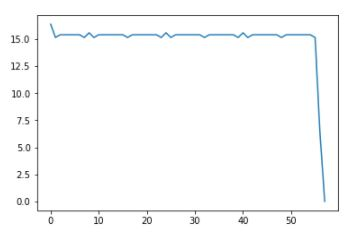
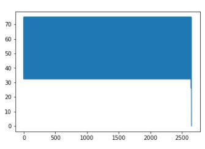
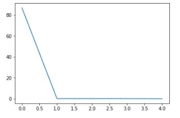
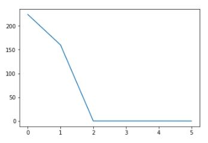
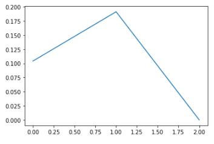
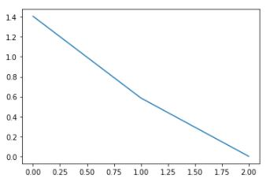

# Pattern Recognition - Assignment 1
### Students' Names:
    Amira Noaman  - 1170400
    Rawda Rumaieh - 1170448

## Batch Perceptron Algorithm
### Description: 
- A perceptron is a linear classifier used for binary classification which divides the space into 2 partitions
- Generally: the process is about getting the gradient at all points --> add them together --> update weighting coefficients
- The batch training is a slow process because the update of the weighting coeff. vector happens after you iterate over all samples

 1. The algorithm has the input of training samples X (features), Y (binary results 1,-1) and the learning rate (default = 1)
 1. Weighting coefficient vector and delta vector is initialized with zeros and they have the same length as the # of features
 1. Then for each point we calculate Weight.X (the prediction) and we check if the label matches the sign of prediction or not
 1. If the sign mismatches, this indicates that the prediction was incorrect so we update the delta value until this delta value becomes so small which means it's not changing anymore
 1. After all iterations are done we update the weights by subtracting the normalized delta obtained multiplied by learning rate
 1. Finally we have the weight coefficients, the number of times required to update weights, the epochs & the delta values that will be plotted later

## Online Training Algorithm
### Description: 
- The online training algorithm has the same process and functions of the batch perceptron algorithm but it's faster 
- We update the weighting coefficient vector after each sample

## Comparions
### Question 1 Output 
|                     | Epochs      | Steps to update weights | delta plot |
|------------         | ----------- | ----------- | -------------|
| **Online Training** | 58          | 175         |  |
|**Batch Training**   | 2651         | 2651        |  |

### Question 4 Output 
|                     | Epochs      | Steps to update weights | delta plot |
|------------         | ----------- | ----------- | -------------|
| **Online Training** | 5          | 9         |  |
|**Batch Training**   | 6         | 6        |  |

### Generated Data Output 
|                     | Epochs      | Steps to update weights | delta plot |
|------------         | ----------- | ----------- | -------------|
| **Online Training** | 3          | 15         |  |
|**Batch Training**   | 3         | 3        |  |
